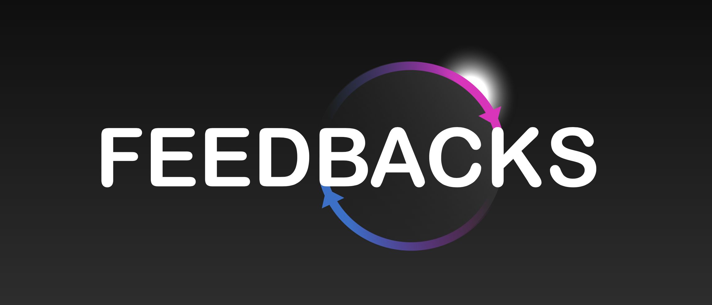

[](https://github.com/apple/swift-package-manager)
 
[](https://codecov.io/gh/twittemb/Feedbacks)

<div style="text-align:center">

</div>

# About

**Feedbacks is a tool to help you build reliable and composable features inside Swift applications. Each feature is based on a System, which stands for all the needed software components that communicate together to perform this feature.**

**Feedbacks is entirely based on a declarative syntax that describes the behaviour of your Systems. If you like SwiftUI, you will enjoy Feedbacks as its syntax promotes compositional patterns and modifiers.**

**A System relies on three things:**

* an initial state
* some side effects
* a state machine

# A prototype is worth a thousand pictures

Here is a System that regulates the volume of a speaker based on an initial volume and a targeted volume.

```swift
struct VolumeState: State { let value: Int }
struct IncreaseEvent: Event {}
struct DecreaseEvent: Event {}

let targetedVolume = 15
        
let system = System {
    InitialState {
        VolumeState(value: 10)
    }

    Feedbacks {
        Feedback(strategy: .continueOnNewState) { (state: VolumeState) -> AnyPublisher<Event, Never> in
            if state.value >= targetedVolume {
                return Empty().eraseToAnyPublisher()
            }

            return Just(IncreaseEvent()).eraseToAnyPublisher()
        }
        
        Feedback(strategy: .continueOnNewState) { (state: VolumeState) -> AnyPublisher<Event, Never> in
            if state.value <= targetedVolume {
                return Empty().eraseToAnyPublisher()
            }

            return Just(DecreaseEvent()).eraseToAnyPublisher()
        }
    }

    Transitions {
        Transition(from: VolumeState.self, on: IncreaseEvent.self) { state, event -> State in
            VolumeState(value: state.value + 1)
        }

        Transition(from: VolumeState.self, on: DecreaseEvent.self) { state, event -> State in
            VolumeState(value: state.value - 1)
        }
    }
}
```

Let's break it down.

# A System is a state machine

> A state machine is an abstract machine that can be in exactly one of a finite number of states at any given time. The state machine can change from one state to another in response to some external events. The change from one state to another is called a transition. A state machine is defined by a list of its states, its initial state, and the conditions for each transition.

A state machine can perfectly describe a feature inside an application. What is great about state machines is their predictability. From a given state and a given event, a transition will always return the same state.

To define a state machine, we need to define three things: the states, the events and the transitions. In the "speaker volume example", we have defined 1 state: the current volume, and 2 events: 1 for increasing the volume, and 1 for decreasing it. All you have to do is then to describe the transitions and the condition of their execution.

Here is the state machine described in the aforementioned System.

<div style="text-align:center">

</div>

On the one hand, defining transitions is about describing what is immutable in an application, what cannot change depending on external conditions, and what is highly predictable and testable.

On the other hand, an application often needs to access data from the network or a database, which depends on conditions that are outside the System (filesystem, data availability, ...). Those side effects can be defined inside Feedbacks.

**We can sum up to this: everything that mutates a state that belongs to the System is a transition, everything that access a state outside the System is a side effect.**

# The feedbacks
A Feedback is a semantical wrapper around a side effect.

In the "speaker volume example", at some point we need to access an external property: the targeted volume. It is external to the System because it is something variable that can be set and stored independently from the System. Its access has to be segregated inside a side effect.

A side effect is a function that reacts to an input state by producing an event that might trigger a transition. As a side effect can be asynchronous (fetching the network for instance), it should return a Publisher of events.

In our example, one feedback takes care of increasing the volume and the other is responsible for decreasing it. They are both executed everytime a new state is generated by a transition.

## Scheduling

Threading is very important to make a nice responsive application. A Scheduler is the Combine way of handling threading by switching portions of reactive streams on dispatch queues, or operation queues or RunLoops.

The declarative syntax of Feedbacks allows to alter the behavior of side effects by simply applying modifiers (like you would do with SwiftUI to change the frame for instance). Modifying the scheduling of a side effect is as simple as calling the `.execute(on:)` modifier.

```swift
Feedbacks {
    Feedback(strategy: .continueOnNewState) { (state: LoadingState) -> AnyPublisher<Event, Never> in
        performLongRunningOperation()
	        .map { FinishedLoadingEvent() }
	        .eraseToAnyPublisher()
    }
    .execute(on: DispatchQueue(label: "A background queue"))
}
```

As in SwiftUI, modifiers can be applied to the container:

```swift
Feedbacks {
    Feedback(strategy: .continueOnNewState) { (state: LoadingState) -> AnyPublisher<Event, Never> in
    	...
    }
    
    Feedback(strategy: .continueOnNewState) { (state: SelectedState) -> AnyPublisher<Event, Never> in
    	...
    }
}
.execute(on: DispatchQueue(label: "A background queue"))
```

Both side effects will be executed on the background queue.

## Lifecycle

There are typical cases where a side effect consist of an asynchronous operation (like a network call). What happens if the very same side effect is called repeatedly, not waiting for the previous ones to end? Are the operations stacked? Are they cancelled when a new one is performed?

Well, it depends 😁. Every feedback constructor that takes a State as a parameter can also be passed an ExecutionStrategy:

* **.cancelOnNewState**, to cancel the previous operation when a new state is to be handled
* **.continueOnNewState**, to let the previous operation naturally end when a new state is to be handled (events will then be concatenated).

## Dependencies

It is unlikely that a side effect don't need dependencies to perform its job. By design, a side effect is a function that can take only a state as an input. Fortunately, Feedbacks provide factory functions to help with the injection of dependencies in your side effects.

```swift
enum MySideEffects {
	static func load(networkService: NetworkService,
			 databaseService: DataBaseService,
			 state: LoadingState) -> AnyPublisher<Event, Never> {
		networkService
			.fetch()
			.map { databaseService.save($0) }
			.map { LoadedEvent(result: $0) }
			.eraseToAnyPublisher()
	}
}

let myNetworkService = MyNetworkService()
let myDatabaseService = MyDatabaseService()
let mySideEffect = SideEffect.make(MySideEffects.load, arg1: myNetworkService, arg2: myDatabaseService)
let feedback = Feedback(strategy: .cancelOnNewState, sideEffect: mySideEffect)
```

`SideEffect.make()` factories will transform functions with several parameters (up to 6 including the state) into functions with 1 parameter (the state), on the condition of the state being the last one.

# Let's gain some altitude

**A System relies on three things:**

* an initial state
* some side effects
* a state machine

Once these things are connected together, it forms a stream of States which we can subscribe to in order to run the System:

```swift
system.stream.sink { _ in }.store(&subscriptions)

or

system.run() // the subscription will live as long as the system is kept in memory
```

A System forms a loop that is also referred to as a **feedback loop**, where the state is continuously adjusted until it reaches a stable value:

<div style="text-align:center">

</div>


# Advanced usage
## The modifiers
Here is a list of the supported modifiers:

| Modifier | Action | Can be applied to |
| -------------- | -------------- | -------------- |
| `.disable(disabled:)`| The target won't be executed as long as the `disabled` condition is true | <ul align="left"><li>Transition</li><li>Transitions</li><li>Feedback</li></ul> |
| `.execute(on:)`| The target will be executed on the scheduler | <ul align="left"><li>Feedbacks</li><li>Feedback</li></ul> |
| `.onStateReceived(perform:)`| Execute the `perform` closure each time a new state is given as an input | <ul align="left"><li>Feedbacks</li><li>Feedback</li></ul> |
| `.onEventEmitted(perform:)`| Execute the `perform` closure each time a new event is emitted | <ul align="left"><li>Feedbacks</li><li>Feedback</li></ul> |
| `.attach(to:)`| Refer to the "How to make systems communicate" section | <ul align="left"><li>System</li><li>UISystem</li></ul> |
| `.uiSystem(viewStateFactory:)`| Refer to the "Using Feedbacks with SwiftUI and UIKit" section | <ul align="left"><li>System</li></ul> |

As each modifier returns an updated instance of the target, we can chain them.

```swift
Feedback(...)
	.execute(on: ...)
	.onStateReceived {
		...
	}
	.onEventEmitted {
		...
	}
```

## State and Event wildcards

Although it is recommended to describe all the possible transitions in a state machine, it is still possible to take some shortcuts with wildcards.

```swift
Transition(from: ErrorState.self, on: AnyEvent.Self, then: LoadingState())
```

Considering the state is ErrorState, this transition will produce a LoadingState whatever event is received.

```swift
Transition(from: AnyState.self, on: RefreshEvent.self, then: LoadingState())
```

Everytime the RefreshEvent is received, this transition will produce a LoadingState whatever the previous state.


## The different ways of instantiating a Feedback

A Feedback is built from a side effect. A side effect is a function that takes a state as a parameter. There are two ways to build a Feedback:

```swift
Feedback(strategy: .continueOnNewState) { (state: State) in
	...
	.map { _ in MyEvent() }
	.eraseToAnyPublisher()
}
```

This feedback will execute the side effect for any type of state. It could be useful if you want to perform a side effect each time a new state is generated, regardless of the type of State.

```swift
Feedback(strategy: .continueOnNewState) { (state: LoadingState) in
	...
	.map { _ in MyEvent() }
	.eraseToAnyPublisher()
}
```
This Feedback will execute the side effect only when it is of type LoadingState.

## Composing Transitions

The more complex a System, the more we need to add transitions. It's a good practice to split them into logical units:

```swift
let transitions = Transitions {
    Transitions {
        Transition(from: LoadingState.self, on: DataIsLoaded.self, then: LoadedState())
        Transition(from: LoadingState.self, on: LoadingHasFailed.self, then: ErrorState())
    }

    Transitions {
        Transition(from: LoadedState.self, on: RefreshEvent.self, then: LoadingState())
    }
}
```

or even externalize them into properties:

```swift
let loadingTransitions = Transitions {
    Transition(from: LoadingState.self, on: DataIsLoaded.self, then: LoadedState())
    Transition(from: LoadingState.self, on: LoadingHasFailed.self, then: ErrorState())
}

let loadedTransitions = Transitions {
    Transition(from: LoadedState.self, on: RefreshEvent.self, then: LoadingState())
}

let transitions = Transitions {
    loadingTransitions
    loadedTransitions
}
```

## How to make Systems communicate?

Systems should be self contained and limited to their business. We should pay attention to make them small and composable. It might occur that a feature is composed of several Systems. In that case we could want them to communicate together.

There is a pattern for that in OOP: Mediator. A Mediator acts as a communication bus between independent components in order to garantee their decoupling.

Feedbacks come with two types of Mediators: `CurrentValueMediator` and `PassthroughMediator`. They are basically typealises of `CurrentValueSubject` and `PassthroughSubject`.

To attach two Systems together:

```swift
let mediator = PassthroughMediator<Int>()

let systemA = System {
	...
}.attach(to: mediator, onSystemState: LoadedState.self, emitMediatorValue: { _ in 1701 })

let systemB = System {
	...
}.attach(to: mediator, onMediatorValue: 1701 , emitSystemEvent: { _ in LoadedDoneEvent() }))
```

When systemA emits a `LoadedState` state, the mediator will propagate the `1701` value among its subscribers and systemB will trigger a `LoadedDoneEvent`.

This way of doing is nice when you do not have a reference on the 2 systems at the same time. You can pass the mediator around or make sure a common instance is injected to you to make the link between your Systems.

If by chance you have a reference on both Systems, you can attach them without a mediator:

```swift
let systemA = System {
	...
}

let systemB = System {
	...
}

systemA.attach(
		to: systemB,
		onSystemStateType: LoadedState.self,
		emitAttachedSystemEvent: { stateFromA in
			LoadedEvent(data: stateFromA.data)
		}
)
```

When systemA encounters the state `LoadedState`, systemB will trigger a `LoadedEvent` event.

# Using Feedbacks with SwiftUI and UIKit

Although a System can exist by itself without a view, it makes sense in our developer world to treat it as a way to produce a State that will be rendered on screen and expect events emitted by a user.

Fortunately, taking a State as an input for rendering and returning a stream of events from user interactions looks A LOT like the definition of a side effect; and we know how to handle them 😁 -- with a System of course. Feedbacks provides a `UISystem` class which is a decoration of a traditionnal `System`, but dedicated to UI interactions.

Depending on the complexity of your use case, you can use `UISystem` in two ways:

* for simple cases, you can instantiate a `UISystem` from a `System`: The resulting system will publish a `RawState`, which is a basic encapsulation of your states. You will have to write functions in your Views to extract the information you need from them. You can find an example of implementation in the [CounterApp demo application](https://github.com/CombineCommunity/Feedbacks/tree/main/Examples/Examples/CounterApp).
* for more complex cases, you can instantiate a `UISystem` from a `System` and a `viewStateFactory` function: The resulting system will publish a `ViewState` which is the output from the `viewStateFactory` function. It allows to implement more complex mappings. You can find an example of implementation in the [GiphyApp demo application](https://github.com/CombineCommunity/Feedbacks/tree/main/Examples/Examples/GiphyApp).

`UISystem` has some specifics:

* it ensures the states are published on the main thread 
* as it is an ObservableObject, it publishes a `state` property we can listen to in SwiftUI views or UIKit ViewControllers
* it offers an `emit(event:)` function to propagate user events in the System
* it offers some helper functions to build SwiftUI Bindings

```swift

enum FeatureViewState: State {
	case .displayLoading
	case .displayData(data: Data)
}

let stateToViewState: (State) -> FeatureViewState = { state in
	switch (state) {
	case is LoadingState: return .displayLoading
	case let loadedState as LoadedState: return .displayData(loadedState.data)
	...
	}
}

let system = UISystem(viewStateFactory: stateToViewState) {
    InitialState {
    	LoadingState()
    }
    
    Feedbacks {
    	...
    }
    
    Transitions {
    	...
    }
}
```

Alternatively, we can build a `UISystem` from a traditionnal `System`:

```swift
let system = System {
    InitialState {
    	LoadingState()
    }
    
    Feedbacks {
    	...
    }
    
    Transitions {
    	...
    }
}

let uiSystem = system.uiSystem(viewStateFactory: stateToViewState)
```

Once started, we can inject the `uiSystem` into a SwiftUI View:

```swift
struct FeatureView: View {

	@ObservedObject var system: UISystem<FeatureViewState>

	var body: some View {
		switch (self.system.state) {
		case .displayLoading: ...
		case let .displayData(data): ...
		}
	}
	
	var button: some View {
		Button {
			Text("Click")
		} label: {
			self.system.emit(RefreshEvent())
		}
	}
}
```

or into a ViewController:

```swift
class FeatureViewController: ViewController {
	var subscriptions = [AnyCancellable]()
	
	func viewDidLoad() {
		self
		.system
		.$state
		.sink { [weak self] state in self?.render(state) }
		.store(in: &self.subscriptions)
	}
	
	func onClick() {
		self.system.emit(RefreshEvent())
	}
}
```

# Examples

You will find a demo application in the Examples folder of the project. We will add new examples as the time goes by.
